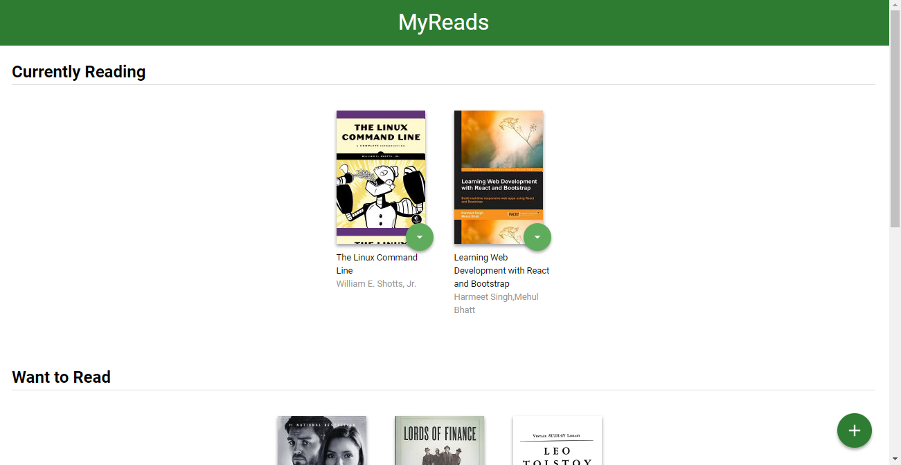
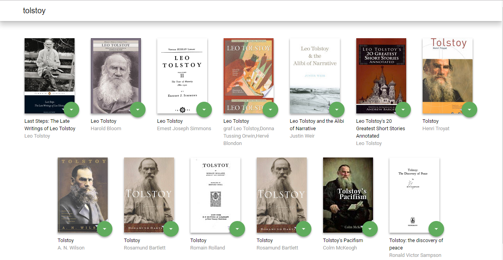

# MyReads

**My Reads** is a single-page web application which allows the user to manage his books. 

## How to run
The application requires Node.js (with npm). If you don't have it on your machine, here's a link for a download: [Node.js](https://nodejs.org/en/)

To run the application, follow these instructions:

* clone the repository with `git clone https://github.com/omarshatani/reactnd-project-myreads-starter.git`
* install all project dependencies with `npm install`
* (optional) optimize the building process with `npm run build`
* start the development server with `npm start`

The application will run on [http://localhost:3000/](http://localhost:3000/)

## Search and navigation
MyReads allows the user to manage the book's shelfs, and search for new ones.

The user can change book's shelf by clicking on the ↓ button and selecting one of the shelfs. If **None** is selected, the book will be removed from the shelfs.

To search for a book, click the + button on the bottom right of the page. 

The user can search for a book's title or author. It will be displayed up to 20 results. 

The application uses a fixed set of cached search results and is limited to a particular set of search terms, which can be found in [SEARCH_TERMS.md](SEARCH_TERMS.md).

## Create React App

This project was bootstrapped with [Create React App](https://github.com/facebookincubator/create-react-app). You can find more information on how to perform common tasks [here](https://github.com/facebookincubator/create-react-app/blob/master/packages/react-scripts/template/README.md).

## Licence

MIT
